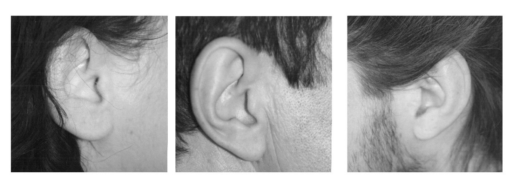
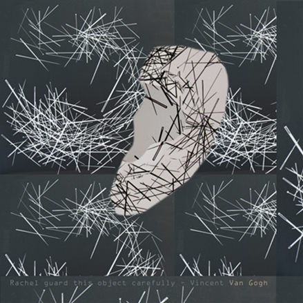
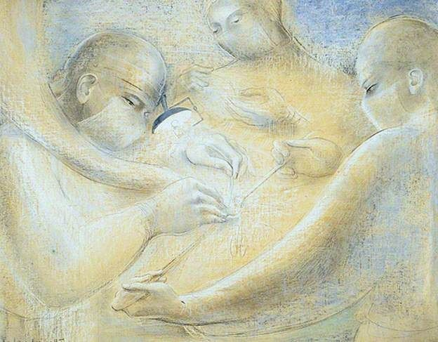
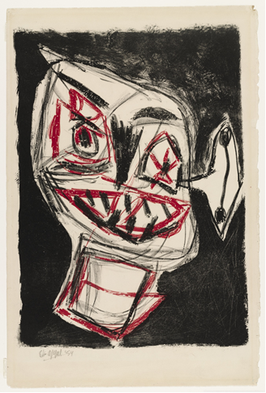
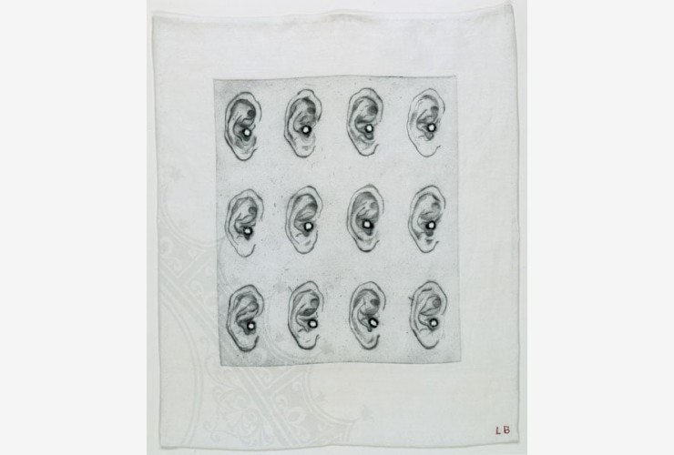
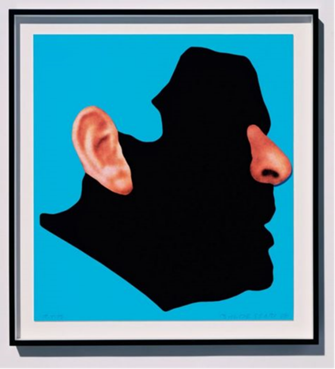

# Ear, The Temple where Otherness is Welcomed, Τranslated , Understood or Misunderstood?

Ιόνιο Πανεπιστήμιο  
Σχολή Μουσικής & Οπτικοακουστικών Τεχνών  
Τμήμα Τεχνών Ήχου και  Εικόνας  
ΠΜΣ “Οπτικοακουστικές Τέχνες στην Ψηφιακή Εποχή”  

Διαδραστικός Ηχητικός Σχεδιασμός

  
  <h4>Ear,  The Temple where Otherness is Welcomed, Τranslated , Understood or Misunderstood?</h4>

     
  
*“Δίχως αυτί δεν υπάρχει τραγούδι ,δίχως αυτί δεν υπάρχει λόγος”*[[1]](#link1) 

#### Εισαγωγή
Τι σχέση υπάρχει ανάμεσα στην Ζαν Ντ’ Αρκ , στον Απόστολο  Πέτρο, τον Σαμψών  και στον Βίνσεντ Βαν Γκόγκ;  
Η Ζαν Ντ’ Αρκ [[2]](#link2) μόλις 12 χρονών άρχισε να ακούει φωνές που την καλούσαν να απελευθερώσει  την Γαλλία από τους Άγγλους τον 15ο αι. και να βοηθήσει τον διάδοχο του γαλλικού θρόνου, Κάρολο, να στεφθεί βασιλιάς. Η γνωστή και ως Ιωάννα  της Λωρραίνης, δήλωνε ότι επικοινωνούσε με το Θεό.  
 Ο Απόστολος  Πέτρος δεν τρόμαξε τη στιγμή που  Ρωμαίοι στρατιώτες  πήγαν να  συλλάβουν τον Χριστό, κι έκοψε το αυτί του Μάλχου, για να αποτρέψει την σύλληψη του Ιησού  στο Όρος των Ελαιών [[3]](#link3). 
 Ο Σαμψών υπήρξε ηγέτης του βιβλικού Ισραήλ. Ο Σαμψών ήταν προικισμένος με μεγάλη σωματική δύναμη,  κυβέρνησε τον ισραηλιτικό λαό και διακρίθηκε για τους επιτυχείς αγώνες του εναντίον των Φιλισταίων, τους οποίους είχε κατατροπώσει με τα κατορθώματα του.   
 Ο Σαμψών [[4]](#link4) νικήθηκε από τους εχθρούς του όταν ερωτεύθηκε μία γυναίκα από την Αλσωρήχ,  τη Δαλιδά . Η γυναίκα αυτή ήταν Φιλισταία , τον εξαπάτησε και απέσπασε το μυστικό της δύναμης του, που  οφειλόταν στα μακριά του μαλλιά . Την ώρα που ο Σαμψών κοιμόταν, η Δαλιδά έκοψε τα μαλλιά του και κατόπιν τον πρόδωσε στους Φιλισταίους, οι οποίοι τον συνέλαβαν, τον τύφλωσαν και τον φυλάκισαν.   
 Το έργο  του Ρέμπραντ [[5]](#link5) του 1636 με τίτλο Η τύφλωση του Σαμψών και το έργο του Vincent Van Gogh, Self-Portrait with Bandaged Ear του 1889, σε πολύ μέτριες αναπαραγωγές κοσμούσαν το δωμάτιο μου, όταν ήμουν μικρή .Οι ιστορίες της Ζαν Ντ’ Αρκ  και του Απόστολου Πέτρου, μου ήταν γνωστές από διηγήσεις  της γιαγιάς μου.   
 Ίσως έτσι ξεκίνησε η αγάπη μου για την προφορικότητα, την αφηγηματικότητα και η αγωνία μου  για τη σχέση των αισθήσεων, της όρασης και της ακοής.  
 
 #### Ερευνητικά ερωτήματα και σκέψεις  
 
 Ασχολήθηκα με την ζωγραφική και  έγινα όλη μάτια.  
 Αποφάσισα, λοιπόν, με αφορμή τις διηγήσεις σας για μύθους, να γίνω όλη αυτιά και να αφηγηθώ μια ιστορία με πρωταγωνιστές τις αισθήσεις όραση και ακοή.  
 Η διαλεκτική σχέση του αυτιού και του ματιού αποτελεί ένα ζήτημα το οποίο έχει απασχολήσει τους μελετητές των ανθρωπιστικών σπουδών, κυρίως όσους ασχολούνται με τη λογοτεχνική θεωρία. Αυτή η σχέση τίθεται ως αντικείμενο μελέτης στο άρθρο της Mary Anderson [[6]](#link6) για το σεξπηρικό έργο  Άμλετ. Η συγγραφέας ξεκινά από τη διαπίστωση ότι στον Άμλετ,  οι αναφορές στα αυτιά και στα μάτια ξεπερνούν τις εκατό πενήντα, γεγονός που υποδηλώνει τη λειτουργική σημασία του μοτίβου στο έργο. Αν και οι αισθήσεις της ακοής και της όρασης είναι απαραίτητες για τη γνώση των φαινομένων,  καθώς μεταφέρουν μηνύματα για τον κόσμο και τη σχέση του εαυτού με τον άλλο, οπωσδήποτε δεν εξαντλούν τους τρόπους, με τους οποίους προσλαμβάνουμε την πραγματικότητα.   
 Το αυτί συχνά μπορεί να υποδέχεται ευχάριστα και άκριτα ψευδείς ειδήσεις, και τα μάτια μπορεί να μην διαυγάζουν αυτό που φανερώνεται μπροστά τους. Η συνέργεια των αισθήσεων, της όρασης και της ακοής, με τον λόγο, την κρίση του ατόμου, είναι βασική προϋπόθεση για την προσέγγιση της πραγματικότητας. Ο Άμλετ, ως κατεξοχήν νεωτερικός ήρωας, και εκπρόσωπος του σύγχρονου διανοούμενου-μελετητή, αμφιβάλλει για το νόημα όσων ακούει και βλέπει και διστάζει, αναβάλλει την ανάληψη της δράσης.   
 Στο Παράρτημα Α της παρούσης εργασίας, η έρευνα μου αφορά τον τρόπο με τον οποίο  διάφοροι εικαστικοί έχουν προσεγγίσει το αυτί. Αναζήτησα τους τρόπους με τους οποίους  ξεδιπλώνουν την αισθητική τους ευαισθησία για τη σωματική, βιωματική και “συναισθητική” ύπαρξη του ανθρώπου.   
 Αν και οι σύγχρονες έρευνες για το ασυνήθιστο φαινόμενο της συναισθησίας , της νευρολογικής ανάμειξης των αισθήσεων, που καθιστά ένα άτομο να ακούει τα χρώματα, και να βλέπει εικόνες μέσω των ήχων, θα μπορούσαν να εμπλουτίσουν την εικαστική ενασχόληση με το αυτί και την ακοή, δεν είναι δυνατόν να αξιοποιηθούν σε αυτήν την εργασία, αλλά πιθανόν να αποτελέσουν αφορμή για μια μεταγενέστερη εκδοχή της.   
 Από όλα τα έργα του Παραρτήματος Α,  ξεχώρισα  την εργασία του Baldessari  που ασχολήθηκε με ζητήματα σημασιολογίας. Ο Baltessari προτρέπει τον θεατή να ανακαλύψει την δική του αφήγηση και διατυπώνει το ερώτημα , εάν ο εικαστικός διαχειρίζεται ζητήματα οπτικής αντίληψης ή σημεία- κώδικες –έννοιες.   
 Επίσης στο έργο του Beethoven's Trumpet (With Ear) Opus # 133 το 2007,εγείρει ερωτήσεις γύρω από το ζήτημα της επικοινωνίας.  
 
 
   
 Baldessari's 'Beethoven's Trumpet (with ear), opus 13' ,2007   
 
 
 
 Σε αυτό το έργο του ο Baldessari  προσεγγίζει το πώς ο Μπετόβεν, έχοντας ήδη χάσει την ακοή του, είναι σε θέση να συνθέσει μια σειρά μουσικών έργων. Το ζητούμενο του  Baldessari  είναι να θέσει σε παρενθέσεις την όραση, δηλαδή εκείνη την αίσθηση ανάμεσα στις πέντε αισθήσεις, η οποία απέκτησε μια προνομιακή θέση κατά τη μετάβαση από την προφορικότητα και τη συμμετοχικότητα, η οποία κατεξοχήν χαρακτηρίζει τις προνεοτερικές, παραδοσιακές κοινωνίες, στο θεωρείν, δηλαδή στην όραση και στο αποστασιοποιημένο βλέμμα που έγινε κυρίαρχο στον νεωτερικό πολιτισμό της γραφής.  Όπως σημειώνεται χαρακτηριστικά,  ο  Baldessari  ενδιαφέρεται για το πως παράγεται νόημα μέσω των άλλων αισθήσεων, πέρα από τη θέαση, την προνομιούχο όραση, “ το έργο του είναι σιωπηρό, δεν απευθύνεται στο αυτί, στην ακοή, μέχρι που ο θεατής σκύβει και μιλάει στη σάλπιγγα, στην τρομπέτα. Εκεί θα ακούσει  μια σύντομη σύνθεση από  τα έξι τελευταία κουαρτέτα του κωφού πλέον Μπετόβεν".
 
#### Μια αφήγηση με τίτλο: «Μια συνομιλία ανάμεσα στο Εγώ και τον Άλλον» 

 The division between eye/'I' and ear/other would appear to  
 structure a number of myths, most notably that of Narcissus and   
Echo, as well as those of Odysseus, Perseus, and Orpheus.  
For Derrida, everything is directed toward the ear of the other,  
 hearing the call of the other,  
having this call shatter the illusory   
 deception of the gaze that desires, a gaze of blindness, blind to its   
 self, as with Narcissus, deaf to the difference that is the voice of  
the other, the difference of Echo's repetitions.  
          At another level, I would suggest that the eye is about  
confrontation or exclusion, while the ear is about an opening up to  
 community, an attempt to accommodate the foreignness of the  
other, a foreignness that reverberates along the tympanum of the  
  ear, shaking the very bones of the self. <a href="#link8">[8]</a> 

  
Κατά τη διάρκεια των σπουδών μου στην Καλών Τεχνών, ένα έργο μου έκανε ιδιαίτερη εντύπωση  
και σημάδεψε τις αναζητήσεις και τις αγωνίες μου.  
Πρόκειται για τους πίνακες του Lucio Fontana, τις χαρακιές πάνω στον καμβά.  

  

Τι να ήταν άραγε η πρώτη χαρακιά του καλλιτέχνη?  
Μια προσπάθεια να ξεφύγει από τη μοναχική και, μερικές φορές, ναρκισσιστική προσήλωση στον καμβά?   
Μια αγωνιώδης προσπάθεια του Εγώ να αγγίξει, να προϋπαντήσει τον κόσμο?   
Ένα μονοπάτι που οδηγεί από τη μονοδιάστατη επιφάνεια του καμβά στον πραγματικό, πολυδιάστατο χώρο των ανθρώπων και της ιστορίας τους?  
Μία δίοδος που επιτρέπει στο Εγώ να συναντήσει τον Άλλον?   
Αυτό που σας παρουσιάζω είναι μια σπουδή για τη συνομιλία, μια εικαστική μελέτη πάνω στην ανθρώπινη επικοινωνία.   
Σε αυτές τις μορφολογικές απόπειρες των αυτιών που ακολουθούν, προσπάθησα να στεγάζω μια αγωνία και ένα ερώτημα.  
Κάθε φορά που μιλάμε σε κάποιον άλλο, πως μας ακούει και τι καταλαβαίνει?  
Κάθε φορά που εγώ μιλάω σε κάποιον, ποιόν αυτός ακούει? Εμένα ή τον εαυτό του?   
Αν ο εαυτός είναι ένα κουβάρι από μνήμες, ιστορίες και αφηγήσεις, τότε μήπως ο άλλος είναι οι απαντήσεις/αποκρίσεις σε αυτές τις ιστορίες?    
Κάθε φορά που τολμώ να εξιστορήσω τον Εαυτό μου στον Άλλο, πως αυτός με προσλαμβάνει? Με κατανοεί ή με παρεξηγεί? Με παρερμηνεύει μήπως? 
Με νοιώθει και με επιβεβαιώνει ή μήπως με ακούει μηχανικά, ναρκισσιστικά και με ακυρώνει?  
Αυτό το παιχνίδι ανάμεσα στον λόγο και στο σώμα, ανάμεσα στην αφήγηση και στο συναισθήματα που προκαλεί, ανάμεσα στον εαυτό και στον άλλον – προσπάθησα να σκεφτώ και να μορφοποιήσω.  
Η εργασία μου επιχειρεί να συγκροτήσει μια συνομιλία ανάμεσα στο Εγώ και τον Άλλον.  
«Ωστόσο διδάχτηκα την οικεία συναναστροφή μ΄έναν σκεφτόμενο άνθρωπο, όπου το ζητούμενο ήταν όχι μόνο ν΄ακούς την κάθε λέξη αλλά και να προσπαθείς να την κατανοήσεις και να πιστοποιήσεις αυτή την κατανόηση με το ν’ απαντάς μ’ ακρίβεια και δίχως διαστρεβλώσεις. Ο σεβασμός για τους ανθρώπους έχει την αρχή του στο να μην αγνοείς τα λόγια τους»αναφέρει ο Ελίας Κανέτι στο βιβλίο του Ο πυρσός στο αυτί [[9]](#link9)
Αυτή η φράση του Ελίας Κανέτι, ήταν η αφορμή να διατυπώσω τα παραπάνω ερωτήματα.   
Ξεκίνησα την εργασία  μου με μια σειρά ρεαλιστικών απεικονίσεων του αυτιού.   

    

     

«Το αυτί τείνει το πρώτο αισθητήριο όργανο που εγκαθίσταται…Κάνει την εμφάνιση του ήδη από τις πρώτες μέρες της σύλληψης.Σχηματίζεται με μια ταχύτητα που δεν τη χωρά ο νους μας ,καθώς λειτουργικά έχει ολοκληρωθεί»[[10]](#link10)
Στον πορεία συνέλεξα φωτογραφικό υλικό.   

    
    
    

    

Θέλοντας να δείξω την αξία της κατανόησης και της προφορικής επικοινωνίας προσπάθησα να δώσω μια ιερή διάσταση σε αυτή τη σειρά μικρών έργων αφιερώνοντας χρόνο, τόσο στη φωτογράφηση όσο και τη ζωγραφική απεικόνιση τους.  
«Το ιδεώδες του σοφού  είναι ένα αυτί έτοιμο να ακούσει» .Αυτή η φράση του Ζακ Σιρακ τριγυρνούσε στο μυαλό μου [[11]](#link11) .  
Ίσως γιατί διαισθάνομαι ότι ενώ ακούμε πολλά κατανοούμε και αφουγκραζόμαστε ολοένα και λιγότερο. Μια φράση του Μπέργκμαν μου φαίνεται ιδιαίτερα  σημαντική, Θέλω να ακούσω όλες τις φωνές να μην τρομάζω με καμία, να παραδοθώ σε αυτές, να τις αφομοιώσω κι όμως να παραμείνω δεκτικός για όλο και καινούριες.  
Σε ένα άρθρο, σχετικό με την φιλοσοφική σημασία της ακοής και του αυτιού, βρήκα το ακόλουθο απόσπασμα, θεωρώντας ότι μπορεί να λειτουργήσει ως καθοδηγητικός μίτος στην πορεία της εργασίας μου:  
*The ear would in some cases, like that of bats, be able to 'see' better than the eye. While the ear is about an opening up to community, an attempt to accommodate the foreignness of the other, a foreignness that reverberates along the tympanum of the ear, shaking the very bones of the self.*   
Τόσο ίδιο και τόσο διαφορετικό συγχρόνως.  
Επιχειρώ ,λοιπόν μια εικαστική προσέγγιση του οργάνου της ακοής, μετά από χρόνια σπουδών –άσκησης  σε ζητήματα οπτικής.  

Το αυτί είναι ένα όργανο του ανθρωπίνου σώματος, κοινό σε όλους μας. Στην οπτική των φυσικών επιστημών, το αυτί υπάγεται σε  μια κοινή ανατομία, η οποία παραγνωρίζει την ποικιλία και την ποικιλομορφία του, ενώ αδιαφορεί για τη φιλοσοφική ή κοινωνιολογική σημασία της ακοής.   
Ωστόσο, στο πλαίσιο της εικαστικής προσέγγισης του κόσμου ,αυτό που προκαλεί το ενδιαφέρον είναι ότι το ανθρώπινο αυτί είναι μοναδικό σε κάθε ανθρώπινο πλάσμα. Το αυτί εικαστικά μας οδηγεί σε ένα κόσμο διαφορετικό και ιδιότροπο, είναι τόσο διαφορετικό αν το παρατηρήσει κανείς εικαστικά. Αυτή είναι και η γοητεία του ως εικαστικού αντικειμένου – το ότι είναι κοινό αλλά και τόσο διαφορετικό συγχρόνως.  
«Με την διαφορετικότητα των ανθρώπων υπήρξα  καταγοητευμένος» έγραφε ο Μπέργκμαν και ο Κανέτι [[12]](#link12) συμπληρώνει με την φράση «Η διερεύνηση της  ακοής απαιτεί ευαίσθητη αντιληπτικότητα, πρέπει κανείς να προσπαθήσει να αναπαράγει αυτήν την αίσθηση μέσα του και να την βιώσει εξαρχής»   
Η ζωή, η εμπειρία και κυρίως η εκ των  υστέρων αφήγησή της αποτελεί μια κοινωνικά σημαίνουσα δραστηριότητα όπου το ατομικό συμπλέκεται με το συλλογικό. Η αφήγηση, η εξιστόρηση μιας προσωπικής εμπειρίας παράγει νοήματα και υφαίνει νήματα, δεσμούς μεταξύ των ανθρώπων και μεταξύ των συμβάντων. Μέσω της αφήγησης αναδύεται ένα πλούσιο δίκτυο αναμνήσεων που μας επιτρέπει να δημιουργούμε διασυνδέσεις ανάμεσα στο πιο ασήμαντο σημείο του δικού μας παρελθόντος και όλων των άλλων.   
Στον Προυστ [[13]](#link13) και συγκεκριμένα στο βιβλίο του με τίτλο «Αναζητώντας τον χαμένο χρόνο», ο ήρωας αποκαλύπτει το νόημα και την ουσία των ανθρώπων και των πραγμάτων μέσω ενός μέρους του εαυτού του που υπάρχει πέρα από τον χρόνο και την μεταβολή. Πρόκειται για ένα πεδίο πέραν του λόγου και της ορθολογικότητας, για εκείνο το πεδίο των αισθήσεων και των αναμνήσεων το οποίο ενεργοποιείται από  την γεύση μιας μαντλεν, βουτηγμένης στο τσάι. Αυτή η αίσθηση, αυτή η γεύση μεταφέρει τον ήρωα του Προυστ στην παιδική του ηλικία - ο ήχος από τα μαχαιροπήρουνα, οι μυρωδιές, οι γεύσεις, το σώμα. Σύμφωνα με τον Γάλλο μυθιστοριογράφο δεν θα ήταν δυνατόν να εξιστορήσουμε τις σχέσεις μας, ακόμα και με ένα πρόσωπο που γνωρίζαμε ελάχιστα, εάν δεν κατορθώναμε να αναπλάσουμε διαδοχικά τα πιο ποικίλα περιβάλλοντα της ζωής  μας.   
Με αφετηρία λοιπόν φράσεις παρμένες από την  λογοτεχνία  ξεκινά ο εικαστικός  στοχασμός πάνω στις αισθήσεις, στην εμπειρία και την θεματοποίησή της μέσω του λόγου ή της εικόνας.   
Σαν φοιτήτρια έπαιξε σημαντικό ρόλο η προτροπή του καθηγητή μου ν’ ασχοληθώ με κάτι που αγαπώ. Ίσως  να αγαπούμε ό,τι δεν κατέχουμε ολόκληρο. Ίσως να μας κεντρίζουν εικαστικά εκείνα τα πράγματα που βρίσκονται ένα βήμα πριν την κατανόησή τους και τον εξορθολογισμό τους. Έτσι λοιπόν ξεκινώ με βάση μια διαίσθηση, μια καλλιτεχνική ανησυχία και την βασική ιδέα ότι συνήθως ο ζωγράφος πρώτα αρχίζει να σκέφτεται το αντικείμενό του με όρους χρωματικούς και μορφολογικούς και μόνο εκ των υστέρων συγκροτεί και αποδίδει ένα σαφές νόημα στην δημιουργία του.   
Η  εργασία μου εστιάζει στην   αισθητική αξία του αποσπασματικού και του ημιτελούς, την αντίσταση στο κλείσιμο, την ομορφιά του ανολοκλήρωτου γι’ αυτό περιορίστηκα κιόλας σε ένα μέρος του ανθρώπινου προσώπου. 
Μετά την φωτορεαλιστική ζωγραφική απόδοση του αυτιού που βασίστηκε σε πολλές φωτογραφίες, σκέφτηκα την μορφολογία της απεικόνισης με βάση το συναίσθημα και την επιθυμίες μου.  
Μάλλον ,επιθυμώ ένα αυτί σαν «φωλιά» ικανό να φιλοξενήσει αυτό που πρόκειται να γεννηθεί ακόμη κι αν βασανιστικά «τρυπιέται» από γραμμές που μοιάζουν με καρφίτσες. «Αυτός ο τρόπος του να ακούς ,δεν ήταν δυνατός δίχως να παραιτηθείς από δικά σου συναισθήματα» [[14]](#link14). 

  
  
           
  
  

Και ενώ νόμιζα ότι πήρα μια απόφαση σχετικά με  το μορφολογικό θέμα της εικόνας του αυτιού, στην πορεία της εργασίας, σκέφτηκα ότι θα μπορούσε η αυτονόητη εικόνα του αυτιού ως όργανο της ακοής να μετατραπεί σε ήχο και έτσι συγκέντρωσα αφηγήσεις [[15]](#link15) ανθρώπων που ενώ είναι διαφορετικές, συνθέτουν μια ενιαία ιστορία.

#### Έγινα όλη αυτιά: Προφορικές αφηγήσεις-μνήμες,Θεσσαλονίκη  

Μέσα από την παραπάνω διερευνητική πορεία, αναζήτηση  επιχείρησα μια αφηγηματική πλοκή με αρχή, μέση και τέλος που δημιουργείται από ένα σύνολο ανθρώπων.
Πρόκειται για προφορικές αφηγήσεις που αφορούν μνήμες και αναμνήσεις, τις ιστορίες κατοίκων της Καλαμαριάς και της Τούμπας που ήρθαν στη Θεσσαλονίκη ως πρόσφυγες από τον Πόντο το 1921.  
Αρχικά ηχογράφησα τις ιστορίες τους. «Η μία επανάληψη έμοιαζε με την άλλη ,τα πάντα ήταν επανάληψη. Οι ήχοι από τους οποίους δεν μπορούσες να ελευθερωθείς , αποτελούνταν από επανάληψη……..» [[16]](#link16).   
Αυτό ένοιωσα ακούγοντας τις ιστορίες τους.  
Αυτό μου έδωσε την ιδέα να ενώσω-να ράψω τις φωνές τους, τις αφηγήσεις τους, σε ένα κοινό, ενιαίο ηχητικό σύνολο. Όλες αυτές οι ιστορίες ήταν ηχητικές αφηγήσεις που όπως αναφέρει ο Ελίας Κανέτι στο βιβλίο του  με τίτλο Ο πυρσός στο αυτί «Δεν τους συνήθισα ποτέ, ο καθένας από τους ήχους της μάζας επιδρούσε επάνω μου» [[17]](#link17). 
Οι διαφορετικές ατομικές αφηγήσεις συνυφαίνονται και έτσι αποτελούν μία ενιαία συλλογική ιστορία – ένα σύνολο με διαφορές.
Μαρτυρούν τους άθλους των καθημερινών, ανώνυμων ανθρώπων, τον μόχθο, τις περιπέτειες και τις αγωνίες τους.  
Η εργασία μου υλοποιήθηκε  με την γλώσσα προγραμματισμού processing και είναι διαδραστική. Ο θεατής μπορεί να επιλέξει με τη βοήθεια του mouse-ποντίκι του υπολογιστή,  να επιλέξει τόσο το τμήμα  της  εικόνας που θα δει  όσο και το ηχητικό στιγμιότυπο της αφήγησης που θα ακούσει.  
Η εικόνα μέσω της διάδρασης του θεατή με το ποντίκι του υπολογιστή,  αλλάζει σύμφωνα με τις φωτογραφίες που ακολουθούν. Άνθρωποι διαφορετικών ηλικιών και ενασχολήσεων, ένα παιδί, η γιαγιά ,μια κομμώτρια κοιτούν τον καθρέφτη και βλέπουν μια εικόνα όπου η ατομική ιστορία συμπλέκεται με τη συλλογική.

    
  Αρχική εικόνα 
   
   
  
         λεπτομέρεια αρχικής εικόνας   

Ο θεατής μέσω της διάδρασης του ποντικιού αποφασίσει σε ποιο μέρος της εικόνας θα εστιάσει και ποιο τμήμα της θα αλλοιώσει. Άραγε και η μνήμη δεν λειτουργεί επιλεκτικά;  

   
        
      
        
        

Η οριζόντια μαύρη γραμμή λειτουργεί σαν τη γραμμή του χρόνου, το timeline στα προγράμματα επεξεργασίας  ήχου και η κάθετη μαύρη γραμμή με την βοήθεια της γλώσσας προγραμματισμού processing, δίνει τη δυνατότητα στο θεατή ,μέσω της διάδρασης να επιλέξει το  στιγμιότυπο του ηχητικού  αρχείου που θα ακούσει. Μπορεί ο θεατής να το ακούσει απαράλλακτο όπως δημιουργήθηκε με το πρόγραμμα Adobe Audition ή να το παραμορφώσει ολότελα, έτσι ώστε να είναι αδύνατον να ακουστεί.  
Με βοήθησε στη μορφοποίηση της ιδέας και η αναφορά σας στο έργο του  Shannοn   που εξετάζει πόση πληροφορία μπορεί να ξεκινήσει από το σημείο Α και να φθάσει στο σημείο Β χωρίς σφάλματα. Η επιθυμητή πληροφορία είναι το "σήμα". Η ανεπιθύμητη είναι τα "παράσιτα" ή ο "θόρυβος". [[18]](#link18) Ο Shannοn  αναφέρει  πως όσο λιγότερο θόρυβο έχει ένα σύστημα τόση περισσότερη πληροφορία μεταδίδει. Και αντιστρόφως, όσο αυξάνεται η αταξία (θόρυβος) ενός συστήματος τόσο λιγότερη πληροφορία μεταδίδει.  
Στο αρχικό αρχείο ήχου, οι ηχητικές αφηγήσεις διαφορετικών προσώπων που όπως προανέφερα, συγκροτούν μια ενιαία ιστορία ,ενώνονται με ήχους από ηχογαβάθες , γκονγκ και άλλα κρουστά. Κάποιοι θεωρούν πατρίδα της ηχοθεραπείας το Θιβέτ, όπου εδώ και αιώνες οι ντόπιοι χρησιμοποιούν ορισμένους ήχους για να θεραπεύσουν ασθένειες. Στα μοναστήρια του Θιβέτ μοναχοί «θεραπεύουν» σωματικές ασθένειες παίζοντας ηχογαβάθες , γκονγκ και διάφορα άλλα κρουστά.  
Την ανθρώπινη δυσκολία συνοδεύουν ήχοι, που εύχομαι να μπορούσαν να έχουν ένα θεραπευτικό χαρακτήρα. Με άλλα λόγια, πρόσθεσα τους θιβετιανούς ήχους σαν μια ευχή προς τον άνθρωπο που πάσχει. 

  

#### Βιβλιογραφία-Ιστογραφία
 [1] Alfred Tomatis ,Το αυτί και η φωνή, (Αθήνα: Ελληνικά Γράμματα,2000),121.  

 [2] Ιωάννα της Λωρραίνης. Βικιπαίδεια.
https://el.wikipedia.org/wiki/%CE%99%CF%89%CE%AC%CE%BD%CE%BD%CE%B1_%CF%84%CE%B7%CF%82_%CE%9B%CF%89%CF%81%CF%81%CE%B1%CE%AF%CE%BD%CE%B7%CF%82 

 [3] Μάλχος (Καινή Διαθήκη) . Βικιπαίδεια.
https://el.wikipedia.org/wiki/%CE%9C%CE%AC%CE%BB%CF%87%CE%BF%CF%82_(%CE%9A%CE%B1%CE%B9%CE%BD%CE%AE_%CE%94%CE%B9%CE%B1%CE%B8%CE%AE%CE%BA%CE%B7)

 [4] Σαμψών (βιβλική μορφή) . Βικιπαίδεια.
https://el.wikipedia.org/wiki/%CE%A3%CE%B1%CE%BC%CF%88%CF%8E%CE%BD_(%CE%B2%CE%B9%CE%B2%CE%BB%CE%B9%CE%BA%CE%AE_%CE%BC%CE%BF%CF%81%CF%86%CE%AE)

 [5] Useum.Online encyclopedia of art.
https://useum.org/artwork/The-Blinding-of-Samson-Rembrandt-1636
 [6] Anderson, Mary. “Hamlet: The Dialect Between Eye and Ear.” Renaissance and Reformation 27 (1991)
https://digital.lib.usf.edu/SFS0024732/00001-

 [7] “The Surprising World of Synaesthesia”, The British Psychological Society, https://thepsychologist.bps.org.uk/volume-28/february-2015/surprising-world-synaesthesia

 [8] Andreas Guibert, La piel develada en las foto-instalaciones de Jose Luis Navarrete
https://www.academia.edu/226059/La_piel_develada_en_las_foto-instalaciones_de_Jose_Luis_Navarrete

 [9] Ελίας Κανέτι , Ο πυρσός στο αυτί, (Αθήνα: Εκδόσεις Καστανιώτη,2004), 257.  

 [10] Alfred Tomatis ,Το αυτί και η φωνή, (Αθήνα: Ελληνικά Γράμματα,2000),120.  

 [11] Alfred Tomatis ,Το αυτί και η φωνή, (Αθήνα: Ελληνικά Γράμματα,2000),120.  

 [12] Ελίας Κανέτι , Ο πυρσός στο αυτί, (Αθήνα:Εκδόσεις Καστανιώτη,2004).  

 [13] Marcel Proust., Αναζητώντας τον χαμένο χρόνο, (Αθήνα :Εκδόσεις Εστία,2011) , 350.  

 [14] Ελίας Κανέτι , Ο πυρσός στο αυτί, (Αθήνα: Εκδόσεις Καστανιώτη,2004),258.  

 [15] Ηχητικό αρχείο εργασίας
https://drive.google.com/file/d/1DaX4qbWDAg8TofWHSEj6rxYnpw-kf-1n/view?usp=sharing  

 [16] Ελίας Κανέτι, Ο πυρσός στο αυτί ,σελ259

 [17] Ελίας Κανέτι, Ο πυρσός στο αυτί ,σελ297

 [18] Claude Shannon:Ο πατέρας της θεωρίας της πληροφορίας, Physics 4U 
http://www.physics4u.gr/articles/shannon.html

 [19] Khan Academy
 https://www.khanacademy.org/humanities/becoming-modern/avant-garde-france/post-impressionism/a/van-gogh-self-portrait-with-bandaged-ear
 
 [20] Artsdot.com
 https://en.artsdot.com/@@/AS7TNM-Karel-Appel-The-Big-Ear
 
 [21] Artists' Books at MassArt. Heredity Study : 1970-71 by Athena Tacha
https://blogs.massart.edu/artistsbooks/2016/03/22/heredity-study-1970-71-by-athena-tacha/

 [22] Printed Matter, Inc. 
 https://www.printedmatter.org/catalog/1359/
 
 [23] ArtFund.
https://www.artfund.org/supporting-museums/art-weve-helped-buy/artwork/9655/ears-2004

 [24] The art story.John Baldessari Artworks.
https://www.theartstory.org/artist/baldessari-john/artworks/

 [25] Labiotech.eu.
https://www.labiotech.eu/bioart/stelarc-ear-art-human-body/

 [26] The body is obsolete - Stelarc
https://www.youtube.com/watch?v=fam73mQQhmk

Ελίας Κανέτι , Ο πυρσός στο αυτί, (Αθήνα:Εκδόσεις Καστανιώτη,2004).

Marcel Proust., Αναζητώντας τον χαμένο χρόνο, (Αθήνα :Εκδόσεις Εστία,2011).

 Alfred Tomatis ,Το αυτί και η φωνή, (Αθήνα: Ελληνικά Γράμματα,2000).
 
 Anderson, Mary. “Hamlet: The Dialect Between Eye and Ear.” Renaissance and Reformation 27 (1991)
https://digital.lib.usf.edu/SFS0024732/00001-

“The Surprising World of Synaesthesia”, The British Psychological Society, https://thepsychologist.bps.org.uk/volume-28/february-2015/surprising-world-synaesthesia

 Useum. Online encyclopedia of art.
https://useum.org/artwork/The-Blinding-of-Samson-Rembrandt-1636

Khan Academy
 https://www.khanacademy.org/humanities/becoming-modern/avant-garde-france/post-impressionism/a/van-gogh-self-portrait-with-bandaged-ear
 
 Artsdot.com
 https://en.artsdot.com/@@/AS7TNM-Karel-Appel-The-Big-Ear
 
 Artists' Books at MassArt. Heredity Study : 1970-71 by Athena Tacha
https://blogs.massart.edu/artistsbooks/2016/03/22/heredity-study-1970-71-by-athena-tacha/

 Printed Matter, Inc. 
 https://www.printedmatter.org/catalog/1359/
 
 ArtFund.
https://www.artfund.org/supporting-museums/art-weve-helped-buy/artwork/9655/ears-2004

The art story. John Baldessari Artworks.
https://www.theartstory.org/artist/baldessari-john/artworks/

  Artsy.net
 https://www.artsy.net/artwork/john-baldessari-face-with-nose-and-ear
 
  Labiotech.eu.
https://www.labiotech.eu/bioart/stelarc-ear-art-human-body/

  The body is obsolete - Stelarc
https://www.youtube.com/watch?v=fam73mQQhmk

Claude Shannon:Ο πατέρας της θεωρίας της πληροφορίας, Physics 4U 
http://www.physics4u.gr/articles/shannon.html

[Ηχητικό Αρχείο Εργασίας](/Istories_Prosfygiko.mp3)   

[Video Interaction with Processing Application](/video_interaction.mp4)  

#### Παράρτημα Α  

#### Οι «αισθήσεις» στην εικαστική τέχνη  

    
  Rembrandt _Sampson Blinding-1636

 
 Ο Van Gogh παραδίδει το ακρωτηριασμένο του αυτί στην  πόρνη Rachel λέγοντας της, «Guard this object with your life» ,την περίοδο που ονειρεύεται να δημιουργήσει ένα studio καλλιτεχνών ,μια κοινότητα καλλιτεχνών. 
                 
Vincent Van Gogh, Self-Portrait with Bandaged Ear-1889<a href="#link19">[19]</a>  

     
 Το 1948  η Dame Barbara Hepworth  που παρακολουθούσε από κοντά πολλές χειρουργικές επεμβάσεις στο έργο της με τίτλο "Fenestration of the Ear (The Microscope)" περιγράφει την προσπάθεια αποκατάστασης της ακοής του ασθενούς. 
        
Fenestration of the Ear (The Microscope) -Dame Barbara Hepworth-1948 

           
 Λίγα πράγματα γνωρίζουμε για το «Μεγάλο αυτί» του Karel Appel εκτός από το γεγονός ότι  ήταν ο ίδιος  και ποιητής και πως το 1948 που συγκροτήθηκε η ομάδα Combra στην οποία συμμετείχε, εκτός από ζωγράφους ,υπήρξε μέλος και ο Βέλγος ποιητής  Christian Dotremont. 
          
Karel Appel. The Big Ear. 1954 | MoMA <a href="#link20">[20]</a>

Στο Heredity Study το 1971 η Αθηνά Τάχα θίγει ζητήματα κληρονομικότητας συγκρίνοντας τα δικά της φυσικά χαρακτηριστικά με τους γονείς της,  τους παππούδες, γιαγιάδες της  

 
Heredity Study<a href="#link21">[21]</a>: 1970-71" by Athena Tacha<a href="#link22">[22]</a>    
 

       
 Τα αυτιά της Louise Bourgeois έχουν μια τρύπα ραμμένη σαν κουμπότρυπα «άδεια» χωρίς το κουμπί. 
                
Louise Bourgeois. Ear. 2004 | MoMA 

  
Louise Bourgeois. Ears. 2004 <a href="#link23">[23]</a>

  
John Baldessari ,Face with Nose and Ear, 2007

  
John Baldessari ,Face with Nose and Ear, 2007
John Baldessari Noses and Ears<a href="#link24">[24]</a>2006

Ο Στέλιος Αρκαδίου γνωστός ως Stelarc ,το 2006 εμφυτεύει ένα αυτί στο χέρι του, με την ελπίδα ότι οι νέες τεχνολογίες να του δώσουν τη δυνατότητα ,οι” ιντερνετικοί” του φίλοι να ακούνε μέσω διαδικτύου, ότι ακούει το τρίτο αυτί του.

Stelarc<a href="#link25">[25]</a>2006<a href="#link26">[26]</a>

